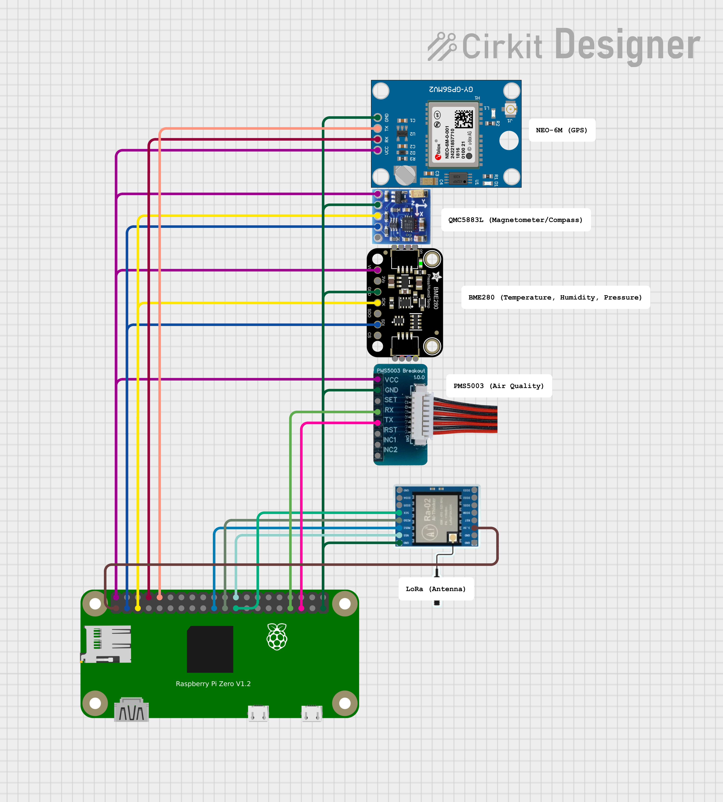

# WTCC Balloon Competition 2025

### Running information

To replicate this project, you need:

1. Raspberry Pi supporting 64-bit OS with Raspberry Pi OS Lite installed
(This project is designed for a `Pi Zero 2 W`)
2. Modified command line arguments: `TODO`
3. Sensors attached (see `Sensors` and `Wiring`)
4. `Python 3.9`
5. Note that in the interest of performance, we are not creating a Docker image for this project.

### Sensors

| Model                                                           | Purpose                         | Link                                                                               | Source Code                                 | Notes                                |
|-----------------------------------------------------------------|---------------------------------|------------------------------------------------------------------------------------|---------------------------------------------|--------------------------------------|
| SX1278 LoRa Wireless Radio                                      | Communicate data back           | https://www.amazon.com/gp/product/B07G7ZRLQB/                                      | https://github.com/chandrawi/LoRaRF-Python  | ONLY 3km RANGE                       |
| GT-U7 NEO-6M GPS Module                                         | Get location and altitude data  | https://www.amazon.com/gp/product/B0B31NRSD2/                                      | N/A (implement using pynmea2)               | No direct Pi compat, use CGPS Module |
| WWZMDiB DS18B20 Temperature Sensor                              | Get barometric temperature data | https://www.amazon.com/gp/product/B0C8J77NJR/                                      | https://github.com/timofurrer/w1thermsensor | NOT USING                            |
| GY-271 QMC5883L Triple Axis Compass Magnetometer Sensor Module  | Get heading                     | https://www.amazon.com/AITRIP-QMC5883L-Compass-Magnetometer-Raspberry/dp/B08ZHKDJH | https://github.com/RigacciOrg/py-qmc5883l   |                                      |
| BMP180 Digital Pressure, Temperature, Altitude Sensor Module    | pressure, altitude, temp        | https://www.amazon.com/gp/product/B0CDQMFX7S/                                      | https://github.com/m-rtijn/bmp180           | NOT USING                            |
| BME280 Altimeter, Pressure Sensor, and Humidity Sensor Module   | altitude, pressure, temp        | https://www.amazon.com/gp/product/B0BQFV883T/                                      | https://github.com/pimoroni/bme280-python   | We are using this sensor             |
| PMS5003 Particle Concentration and Air Quality Detection Sensor | air quality woo                 | https://www.amazon.com/gp/product/B0BG62Z8L3                                       | https://github.com/pimoroni/pms5003-python  |                                      |            |
| DS18B20 Temperature Sensor Module Kit (other version)           | Barometric temperature          | https://www.amazon.com/gp/product/B0924NBNZP/                                      | https://github.com/timofurrer/w1thermsensor |                                      |

### Wiring

> [!NOTE]
> We have the BMP180, BME680, and DS18B20 sensors that all have the same functionality

readme by [@quantumbagel](https://github.com/quantumbagel)